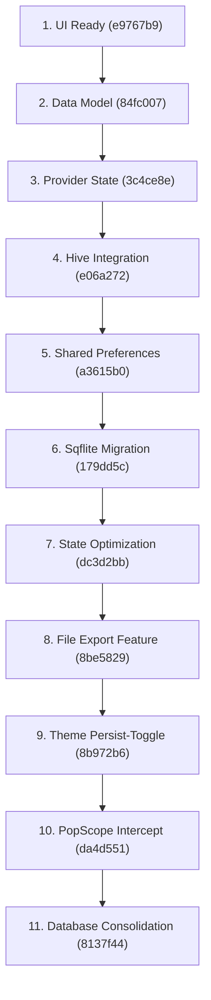

# 📝 Flutter Notes: A Multi-Level Database & Architecture Showcase

An educational, step-by-step Flutter project designed to demonstrate production-grade state management, platform file integration, dynamic theme systems, and a **multi-tier storage evolution** showing the transition between three storage approaches: **Shared Preferences, Hive, and Sqflite**.

---

## 🎯 Motivation

When learning Flutter, developers often face a steep gap between writing simple UI mockups and architecting production-ready applications. Storing data locally is a fundamental requirement, but there is no "one-size-fits-all" database solution. 

This project was built to serve as a **living educational blueprint**. Instead of presenting a finished app, it is structured to show a **gradual, chronological progression** of features. By following the git history, developers can observe how a real-world project is incrementally constructed—transitioning from static UI templates to structured data models, decoupled state management, and eventually progressing through three distinct local database levels.

---

## 🏗️ The 4 Core Architectural Pillars

The application is structured around four primary architectural concepts, representing crucial skills for intermediate Flutter developers:

### 1. The 3 Database Levels
To teach local storage strategies, the project showcases three storage tiers, each suited for different use cases:

| Database Tier | Package Used | Storage Style | Primary Purpose in App | Key Learning Takeaway |
| :--- | :--- | :--- | :--- | :--- |
| **Level 1: Key-Value** | `shared_preferences` | Key-Value Pairs | Persists app launch flags (`first`) and visual settings (`isDark`). | Best for storing lightweight, unstructured configurations, user preferences, and flags. |
| **Level 2: NoSQL Document** | `hive` *(Historical Step)* | NoSQL Document / Boxes | Acted as the first local object database using binary adapters to serialize Note documents. | Demonstrates ultra-fast, lightweight document stores that serialize models directly without tables or SQL. |
| **Level 3: Relational SQL** | `sqflite` *(Final Notes Engine)* | SQLite Relational SQL | Implements a robust schema, automatic ID generation, and full CRUD query execution on Notes. | Essential for complex relational schemas, advanced querying, transactional integrity, and standard structured datasets. |

### 2. Provider State Management
Rather than locking state inside individual widgets, the application decouples business logic using the `provider` package:
- **`MultiProvider`**: Configured at the root (`main.dart`) to inject databases and state controllers globally.
- **`SystemDB` (`ChangeNotifier`)**: Directs reactive theme rebuilding using `notifyListeners()`.
- **`NotesDB`**: Provided as a dependencies-only provider to ensure a single source of database connections is cleanly accessible anywhere in the widget tree using `context.read<NotesDB>()`.

### 3. Native File Management & Exporting
To teach system integrations outside the application sandbox:
- **`path_provider`**: Interacts with the OS directory structures to spin up safe, transient workspace caches (`getTemporaryDirectory`).
- **`flutter_file_dialog`**: Prompts native system dialog sheets to let users choose exactly where to export their notes as plain text (`.txt`) files globally on their device.

### 4. Dynamic Visual Systems & OS Intercepts
- **Persistent Theme System**: Utilizes custom `ThemeProvider` profiles and custom fonts (`Beyno`) coupled with Shared Preferences to automatically remember the user's dark/light preference across app sessions.
- **Pop Gestures & UI Interception**: Uses Flutter's modern **`PopScope`** to intercept swipe-back actions or physical back button presses inside `NoteViewPage`. This guarantees that if the user exits mid-edit, their drafts are silently and reliably auto-saved via `NoteViewPageService.saveAndExit()`.

---

## 🛣️ Chronological Guided Learning Path (Git History)

A learner can check out each commit sequentially to watch the project build from the ground up:



### 📋 Detailed Commit-by-Commit Walkthrough

#### Step 1: UI Foundation (`git checkout e9767b9`)
* **Objective:** Establish the visual architecture first.
* **Details:** Setup standard material scaffolds, customizable typography (using a custom `Beyno` font asset), beautiful note grid UI layouts, and basic route configurations.

#### Step 2: Defining the Model Schema (`git checkout 84fc007`)
* **Objective:** Move from hardcoded UI values to dynamic datasets.
* **Details:** Introduce the standard object model `Note.dart` equipped with serialization mapping (`toJson()` and `fromJson()`) to prepare objects for serialization.

#### Step 3: Decoupling State with Provider (`git checkout 3c4ce8e`)
* **Objective:** Introduce state architecture.
* **Details:** Implement the `provider` package to manage state propagation and break out logic from UI files.

#### Step 4: Level 2 Database - Object Persistence with Hive (`git checkout e06a272`)
* **Objective:** Connect the first local database.
* **Details:** Integrate **Hive** and construct specialized adapters to serialize notes and read/write them instantly to local disk.

#### Step 5: Level 1 Database - Configurations with SharedPreferences (`git checkout a3615b0`)
* **Objective:** Configure key-value pairs.
* **Details:** Create `SystemDB` driven by **Shared Preferences**. It tracks startup preferences (like if it is the user's first launch) and toggles preferences like dark themes.

#### Step 6: Level 3 Database - Relational Database with Sqflite (`git checkout 179dd5c`)
* **Objective:** Introduce highly structured database transactions.
* **Details:** Configure a relational database system (`NotesDB`) using **Sqflite**. Build raw SQLite tables and design transactional CRUD queries (Create, Read, Update, Delete) to manage notes.

#### Step 7: Optimization of UI-State Rebuilds (`git checkout dc3d2bb`)
* **Objective:** Clean up unnecessary notifier triggers.
* **Details:** Refactor state handlers to let Flutter's navigation transitions naturally control widget rebuilds rather than relying on redundant `ChangeNotifierProvider` updates for immutable caches.

#### Step 8: Native File Operations (`git checkout 8be5829`)
* **Objective:** Interact with the native operating system file directories.
* **Details:** Implement a service to write note contents into short-lived files via `path_provider` and export them globally through native save sheets with `flutter_file_dialog`.

#### Step 9: Persistent Theme Engine (`git checkout 8b972b6`)
* **Objective:** Build visual preferences.
* **Details:** Tie the `SystemDB` state toggles to a customized `ThemeProvider` visual kit, instantly switching colors and surfaces at runtime and keeping them persisted on app restarts.

#### Step 10: Intercepting Gestures with PopScope (`git checkout da4d551`)
* **Objective:** Prevent data loss during accidental swipe-backs.
* **Details:** Wrap the note editing scaffold inside modern **`PopScope`** to intercept page pops, immediately triggering the note preservation service to commit drafts before completing navigation.

#### Step 11: Database Migration & Consolidation (`git checkout 8137f44`)
* **Objective:** Complete database tier comparisons.
* **Details:** Perform a migration that replaces Hive storage with Sqflite for notes, finalizing the clean architecture and illustrating how developers can transition storage backend engines without breaking front-end models.

---

## 🛠️ Tech Stack & Dependencies

* **Language:** Dart
* **Framework:** Flutter (Material Design 3 & iOS Cupertino Transitions)
* **State Management:** `provider`
* **Local Storage:** `sqflite`, `shared_preferences`
* **File System Services:** `path_provider`, `flutter_file_dialog`

---

## 🚀 Getting Started

### Prerequisites
Make sure you have the [Flutter SDK installed](https://docs.flutter.dev/get-started/install).

### Installation & Launch
1. **Clone the repository:**
   ```bash
   git clone <repository-url>
   cd notes
   ```

2. **Fetch all dependencies:**
   ```bash
   flutter pub get
   ```

3. **Run on an emulator or active hardware device:**
   ```bash
   flutter run
   ```

### 🎓 Learning Exercise
To fully appreciate the architectural shifts, open a terminal in the folder and check out the early stages:
```bash
# See the initial UI template
git checkout e9767b9

# Observe how Hive was first configured
git checkout e06a272

# Review the final consolidated Sqflite architecture
git checkout main
```
